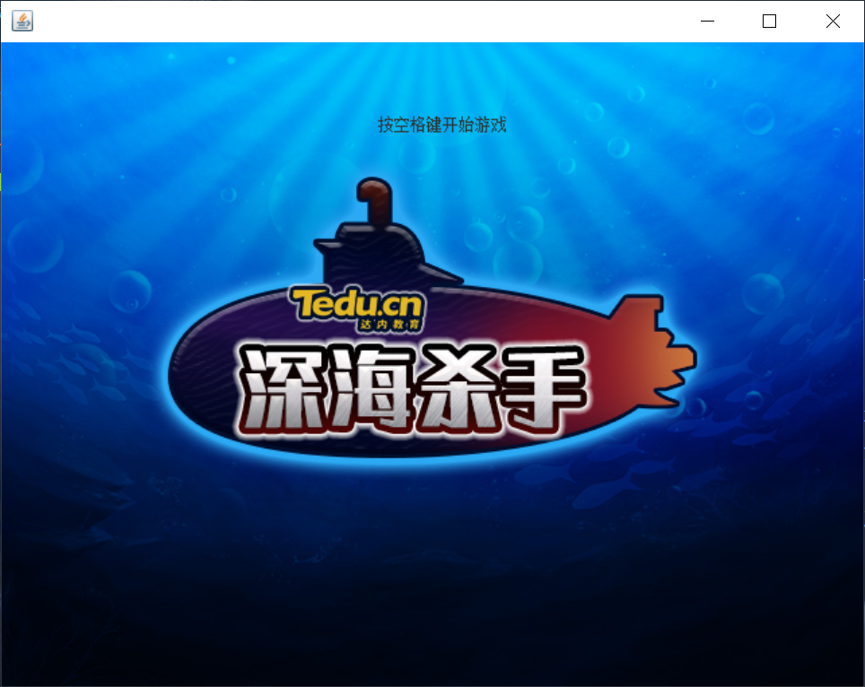

###### 📢❗❗❗ 2022.4.11 ❗❗❗
```text
📢 新增功能：1、paint方法中绘制绘制命数、分数
2、深水炸弹与潜艇碰撞具体逻辑修改为判断当前潜艇对象是否实现了加分或加命的接口,然后再去转换实现
3、ameWorld类新增三个状态
（1）、开始状态(Start):右键运行后呈现的界面,绘制一张开始界面的图片。当按下空格键则切换为运行状态
（2）、运行状态(Running):调用所有自动行为的方法
（3）、结束状态(GameOver):当战舰的命数为0时,切换为结束状态
``` 
###### 👨‍💻👩‍💻旧版本已迭代在前期的 master 里
###### 👀 如果你当前使用的是旧版本，[可在本页clone最新版](https://gitee.com/muyiafa/Game_DeepSeaKiller)

# 深水炸弹小游戏



[//]: # ([![python3]&#40;https://img.shields.io/badge/Python-3.9-red.svg&#41;]&#40;https://www.python.org/downloads&#41;)
[//]: # ([![Django3.2]&#40;https://img.shields.io/badge/Django-3.2.4-green.svg&#41;]&#40;https://docs.djangoproject.com/zh-hans/3.2&#41;)
[](https://github.com/newpanjing/simpleui)

🙈🙈🙈 使用Java基础开发（demo为电脑运行）

优点：减少逻辑性，便于入门学习...
缺点：玩法单一...
体量：核心代码约 650 行

### 开发环境
* Java: 1.8
* IDEA: 2021.3

### 示例博客：http://www.muyiafa.com

### 功能点
* 战舰炮弹Y向下移动
* 鱼雷Y向上移动
* 深水炸弹Y向上移动
* 鱼雷潜艇X向右移动
* 深水炸弹潜艇X向右移动
* 侦查潜艇X向右移动
* 战舰击中潜艇加分
* 潜艇击中战舰减命


## ⬇ 源码下载
```
GitHub：gitee.com/muyiafa/Game_DeepSeaKiller
or
Gitee：github.com/muyiafa/Game_DeepSeaKiller
or
personalWebsite：https://www.muyiafa.com
```

### 安装
```
1：下载项目IDEA用打开项目即可
```

### 使用
```
运行 src/com/muyiafa/submarine/GameWorld.java
```
### END:

---
##### 🙏 更多详情
请移步 [wikis](https://gitee.com/muyiafa/Game_DeepSeaKiller/wikis) 

##### ❓ 问题相关
欢迎提交问题到 [Issues](https://gitee.com/muyiafa/Game_DeepSeaKiller/issues) 一起交流

EMAIL： `email@muyiafa.com`。
