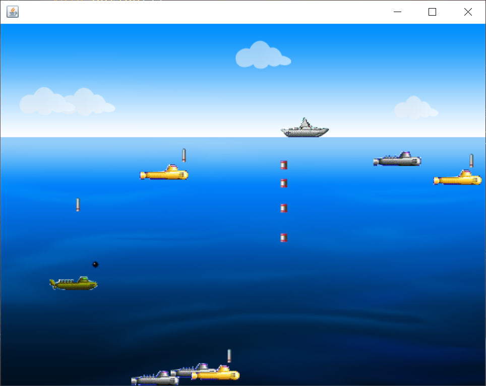

###### 📢❗❗❗ 2022.4.4 ❗❗❗
```text
📢 小幅升级维护
``` 
###### 👨‍💻👩‍💻旧版本更新到最新 master 请先点这里 [升级事宜](https://www.yangmufa.com)
###### 👀 如果你未正在使用旧版本的话，直接按照安装使用说明部署即可

# 深水炸弹小游戏

项目基本完成，处于试运行阶段，示例网站为当前分支最新代码，
如果您想查看旧版本，可以到标签中选择对应的版本进行下载

ps: 个人博客在一些逻辑和限制上面考虑还欠周全，存在bug，不影响正常使用，
后续开发已暂缓，欢迎 pull request，我将在审阅并测试后第一时间通知您

[//]: # ([![python3]&#40;https://img.shields.io/badge/Python-3.9-red.svg&#41;]&#40;https://www.python.org/downloads&#41;)
[//]: # ([![Django3.2]&#40;https://img.shields.io/badge/Django-3.2.4-green.svg&#41;]&#40;https://docs.djangoproject.com/zh-hans/3.2&#41;)
[](https://github.com/newpanjing/simpleui)

🙈🙈🙈 使用Java基础开发（仅一个app，目前不支持手机运行）

优点：减少逻辑性，便于入门学习...

缺点：内容沉余，不够灵活...

### 基本要求
* Java: 1.8
* IDEA: 2021.3
* Mysql: 无

### 示例博客：http://www.muyiafa.com（开发中）

### 功能点
* 用户注册，登录，登出，注销，密码邮箱验证重置
* markdown文章渲染，代码高亮，支持后台markdown编写文章等
* 文章分类，归档，快捷搜索，标签集
* 4 种皮肤（清新，清爽，简约，暗黑）切换
* 文章排行榜 / 最新评论 / 阅读量排行榜
* 博文评论系统（基本功能）
* 多目标源博文分享（支持https）
* echarts 博文发布，标签统计图（折线图，饼图，梯形图）
* 文章分类 雷达统计图（雷达图）
* 网站配置数据 redis 缓存
* windows: django-gzip压缩主站，linux: nginx-gzip压缩全站
* Rss / Atom 订阅
* 支持图床，后台上传图片可直链访问及调用
* simpleui后台管理


###### ps: 如果访问网站期间，你使用了某些墙代理网络，会失去一些网页功能 ！！！

## ⬇ 源码下载
```
https://gitee.com/muyiafa/Game_DeepSeaKiller.git
or
https://github.com/muyiafa/Game_DeepSeaKiller.git
```
敏感词文件内容 
com.muyiafa.submarine.GameWorld,//运行类
Battleship ship = new Battleship();//声明一个战舰类型的变量
Bomb bombs[] = {};//声明一个深水炸弹类型的数组变量
SeaObject[] submarines = {};//代表三种潜艇：侦查潜艇、鱼雷潜艇、水雷潜艇
SeaObject[] thunders = {};//代表两种雷

### 安装
```
1：下载项目IDEA打开
2-1：运行GameWorld类
```

### 使用
```
# 初始化


# 常见报错：
```
### END:

---
## 🙏 更多博客
请移步 [wikis](https://www.yangmufa.com) 查看

## ❓ 问题相关
欢迎提交问题到 [Issues](https://gitee.com/wu_cl/DBlog/issues) 或邮箱 `email@yangmufa.com`, 欢迎一起交流